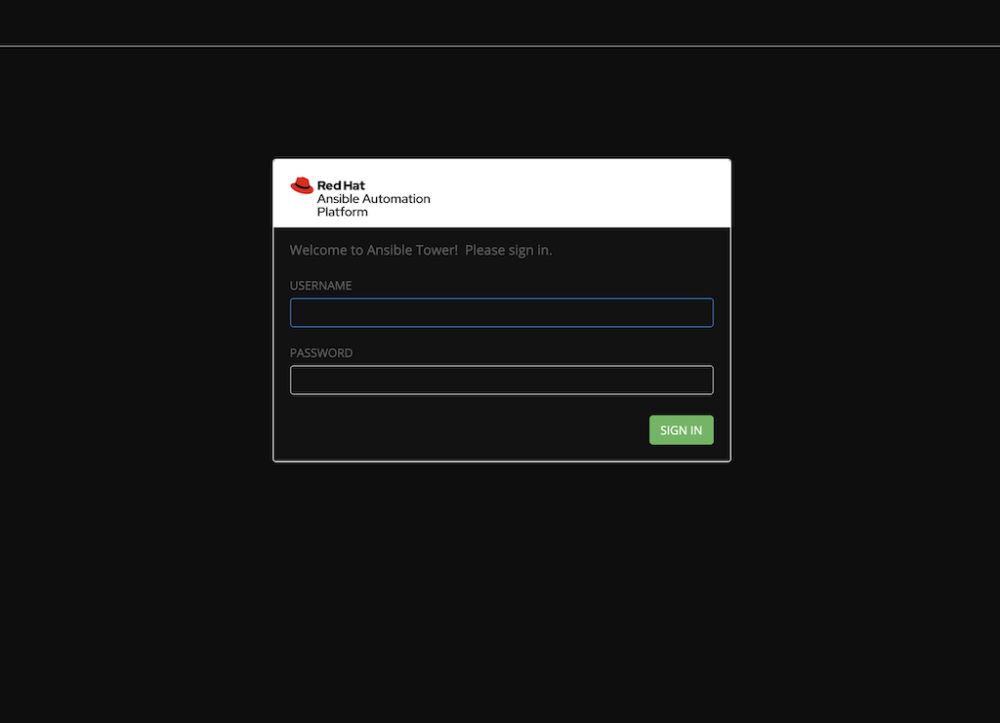
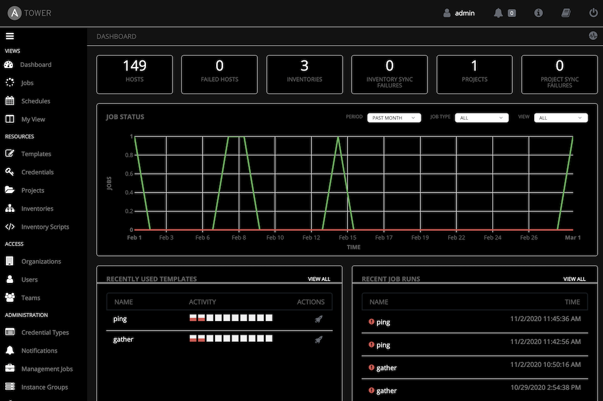
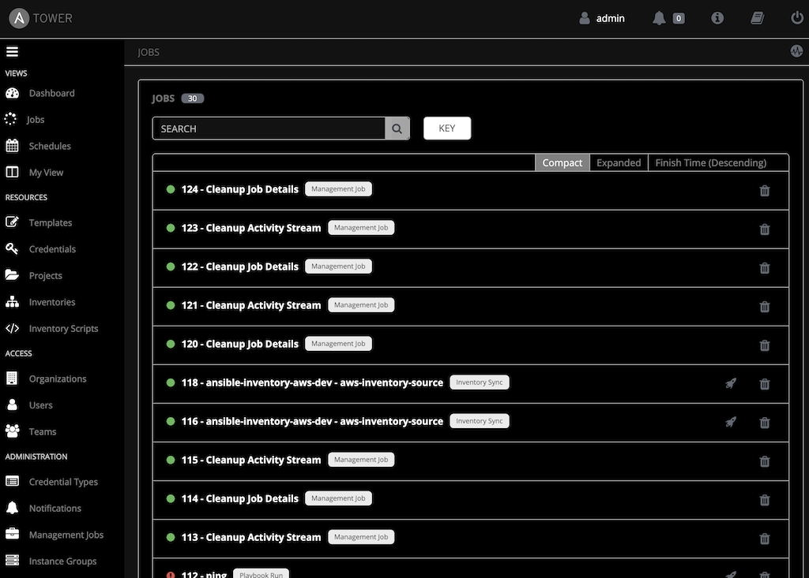
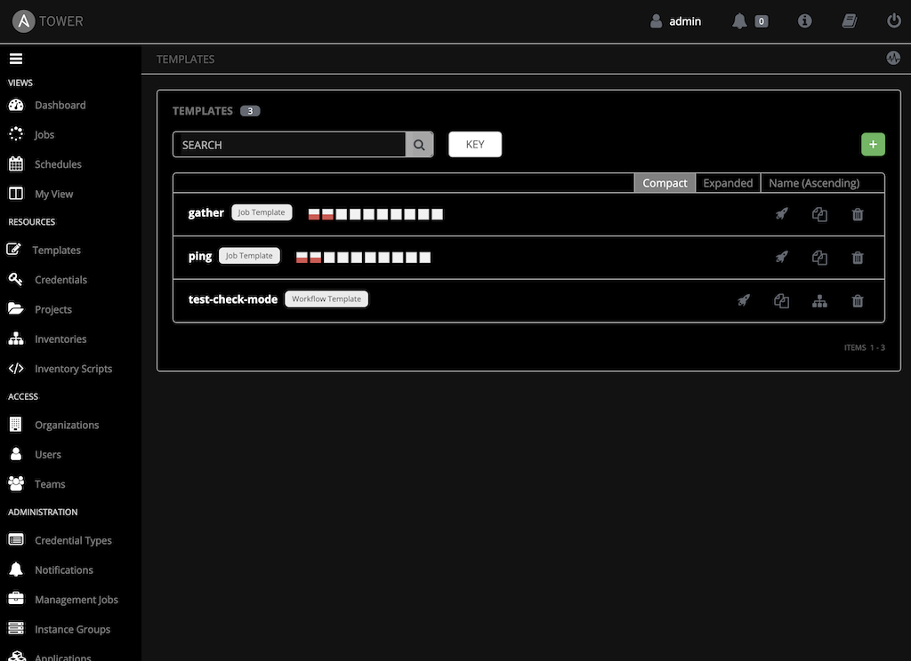

# Dark Mode for Ansible Tower

Enable/disable **dark mode** for Ansible Tower and customize it as you wish.

## Screenshots

Here are some screenshots showing comparisons between Ansible Tower `light mode` (standard mode) and the new `dark mode`.






## Background

In case you haven't noticed, there has been a trend in the past few years where applications have been allowing you to switch applications to something called a `dark mode` theme that has been shown to be easier on the eyes compared to the typical bright white background. Companies such as Apple, Google as well as many others now support dark mode.  

There are many arguments for and against using dark mode, but [here's an article](https://www.androidauthority.com/dark-mode-1046425/) that I found fascinating and worth reading.

Ansible Tower has always had a bright white background and I decided to play around with it and build a dark mode.

Perhaps this will inspire the Red Hat Ansible team to build a proper dark mode theme for Ansible Tower.

## Usage

This is an Ansible Role where the `tower_dark_mode` variable can be overridden to either enable or disable dark mode using values `present` or `absent` to declare the state. 

Simply clone the repository into your `roles` folder or add a reference to the repository using `roles/requirements.yml`. Then you can write a Playbook as shown below. The Playbook must target the `tower` inventory group as defined typically in the Ansible Tower installation inventory. The role will simply push a Custom Style Sheet file to each of the web servers running on the Tower nodes and update a file to reference this style sheet.

```yaml
---
- hosts: tower
  gather_facts: false
  
  tasks:
  
  - include_role:
      name: ansible_tower_dark_mode
    vars:
      tower_dark_mode: present
```

## Customize

Feel free to customize [the CSS file](templates/darkmode.css.j2) in order to create your own theme that matches perhaps your company colors. I tried to add comments to explain the various bits in the CSS file so you can change them easily. Notice that the file is a Jinja template!

## Custom Logo

To match the new dark mode style for Ansible Tower you can additionally change the logo in Ansible Tower if you wish. This has always been available and can easily be done within the Ansible Tower interface. See [here](https://docs.ansible.com/ansible-tower/latest/html/administration/custom_rebranding.html) for more details.

## References

[Love dark mode? Here’s why you may still want to avoid it](https://www.androidauthority.com/dark-mode-1046425/)
[Using Custom Logos in Ansible Tower](https://docs.ansible.com/ansible-tower/latest/html/administration/custom_rebranding.html)

## Author

John Wadleigh  
Senior Architect @ Red Hat

https://www.ansiblejunky.com/
